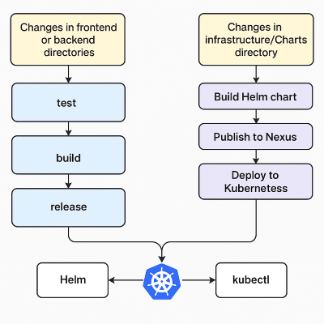
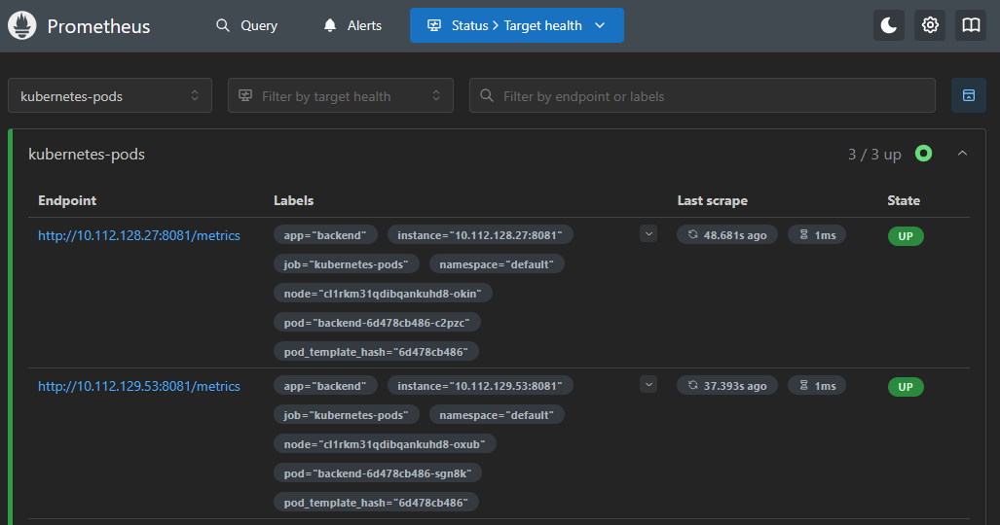
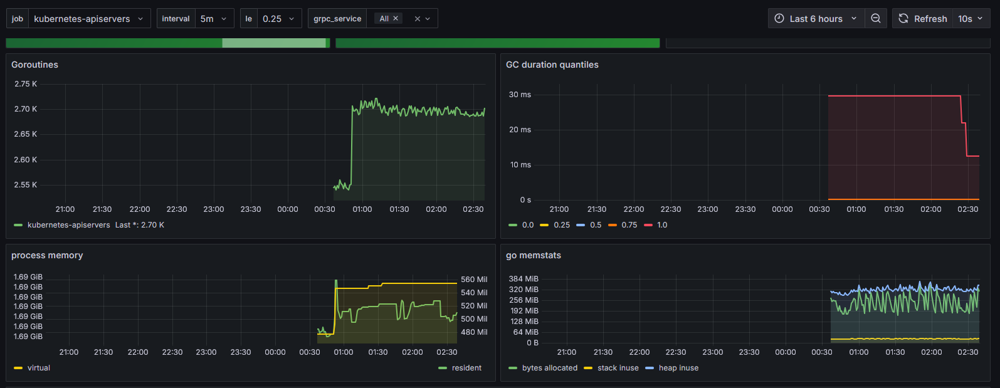
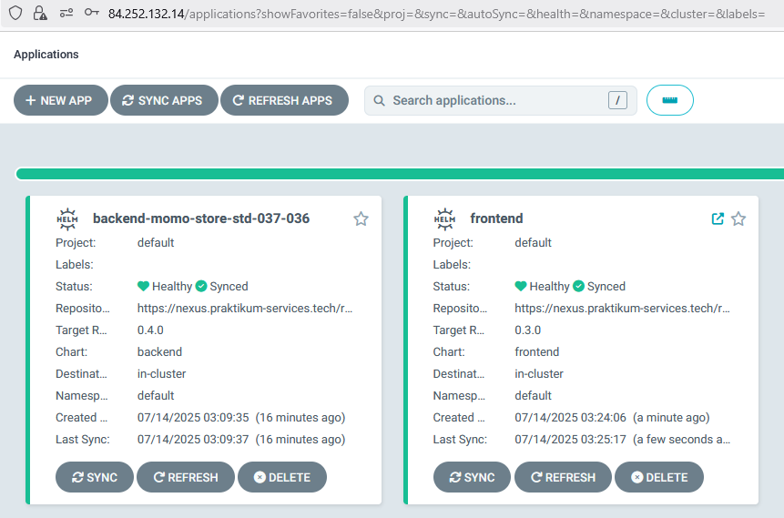

## Описание проекта

<br/>
<hr/>
<br/>

Данный проект разработан  в учебных целях ЯндексПрактикум по направлению "DevOps для эксплуатации и разработки".
По исходному заданию [https://gitlab.praktikum-services.ru/Stasyan/momo-store](https://gitlab.praktikum-services.ru/Stasyan/momo-store)

#### **Исходные данные:** 
#### Momo Store aka Пельменная №2


#### Frontend

```bash
npm install
NODE_ENV=production VUE_APP_API_URL=http://localhost:8081 npm run serve
```

#### Backend

```bash
go run ./cmd/api
go test -v ./... 
```

<br/>
<hr/>
<br/>

#### **Ссылка на пельменную:** [std-037-036-momo-store.ru](https://std-037-036-momo-store.ru)
#### **Ссылка на репозиторий с дипломным проектом:** [пельменная в gitlab](https://gitlab.praktikum-services.ru/std-037-36/nk)

Для этих ссылок нужно знать креды, но пусть тоже тут будут:
#### **Ссылка на Grafana:** [http://51.250.40.54:3000](http://51.250.40.54:3000)
#### **Ссылка на Prometheus:** [http://84.252.135.149](http://84.252.135.149)
#### **Ссылка на AgroCD:** [https://84.252.132.14](https://84.252.132.14)

<br/>
<hr/>
<br/>

### **В ходе работы выполнено:**

### Сборка Docker образов
 - Написаны Dockerfile 
 - Frontend:
 	-  Сборка фронтенда происходит этапами, с использованием Node.js в первом этапе и упаковкой статических файлов в легковесный образ Nginx во втором.

    ```dockerfile
     FROM node:16-alpine3.16 as builder
      WORKDIR /app
      COPY . . 
      ENV VUE_APP_API_URL=/
      ENV NODE_ENV=/
      RUN  npm ci --include=dev \
      && npm run build 

      FROM nginx:1.25.1
      WORKDIR /usr/share/app
      COPY --from=builder /app/dist/ /usr/share/app
      COPY --from=builder /app/frontend.conf /etc/nginx/conf.d/
    ```

 - Backend:
 	- Сборка приложения на Go в первом этапе. На втором - создание минимального образа на Alpine, добавление пользователя и запуск с использованием dumb-init для управления процессами.	   
    ```dockerfile
     FROM golang:latest as builder
      WORKDIR /app
      #copy go.mod go.sum and run go mod download for cashe
      COPY go.mod go.sum ./
      RUN go mod download
      COPY . . 
      RUN CGO_ENABLED=0 GOOS=linux go build -a -installsuffix cgo -o main ./cmd/api

      FROM alpine:latest  
      WORKDIR /app/.
      RUN addgroup --system gouser \
          && adduser -S -s /bin/false -G gouser gouser -D -H \
          && apk add --no-cache dumb-init=1.2.5-r3
      COPY --chown=gouser:gouser --from=builder /app/main .
      USER gouser
      ENTRYPOINT ["dumb-init", "./main"] 
    ```


### Хранение артефактов
- Артефакты сборки (Docker образы) попадают в хранилище [gitlab Container Registry](https://gitlab.praktikum-services.ru/std-037-36/nk/container_registry)
- Helm чарты хранятся в Nexus [frontend](https://nexus.praktikum-services.tech/#browse/browse:std-037-036-momo-front), [backend](https://nexus.praktikum-services.tech/#browse/browse:std-037-036-momo-backend)

### Облако

- Создано личное облако
- Добавлен сервисный аккаунт для управления и создания инфраструктуры
- S3 бакет для хранения terraform.state

### Terraform

- Код находится в директории infrastructure/terraform
- В коде описано создание Kubernetes кластера:
    - Создание сети для кластера
    - Создание DNS и DNS записи
    - Создание кластера и воркер ноды

- Запустить создание инфраструктуры можно с помощью команд:
	-  ```bash
		terraform init -backend-config=secret.backend.tfvars -reconfigure
		```
	-  ```bash
		terraform plan
		```
	-  ```bash
		terraform apply
		```        

### K8S

- Вручную был добавлен и настроен CertManager и пройдена валидация созданного сертификата
- Написаны манифесты для автоматического деплоя пельменной в кластер.
- Обновление предполагается через Helm чарты, об этом ниже.
- Добавлен мониторинг по этой [инструкции](https://yandex.cloud/ru/docs/managed-kubernetes/tutorials/prometheus-grafana-monitoring) и этой [инструкции](https://yandex.cloud/ru/docs/managed-kubernetes/operations/applications/argo-cd)

### Helm
- Helm чарты основаны на манифестах K8S
- Упаковка новой версии пакета происходит в пайплайне (при измениниях в директории чартов)
- Новый пакет отправляется в хранилище артефактов Nexus
- Новый пакет деплоится в кластер, в пайплайне, с помощью Helm (специально захотелось попробовать так сделать)
- Управление Helm чартами доступно так же из AgroCD


### GitLab Pipeline
- Теперь соберем в кучу всю информацию, что была выше!
- Исходный код и описание инфраструктуры лежат в одном репозитории. В разных я пробовал, а в одном еще нет.
- Так как  job повторяются в frontend и backend они вынесены в отдельную папку /jobs/ и подключаю к проекту  с помощью include.
- В случае изменений в директориях Фронтенда или Бекенда
	- test (выполняются sast тесты gitlab sast + sonarqube)
	- build (Построение образа с помощью dockerfile)
	- release (тегирование образа)
- В случае 	изменений в директории с Helm чартами (infrastructure/Charts):
	- Запустится сборка helm чарта с версией указанной в чарте
	- Собранный чарт отправится в Nexus
	- Запустится деплой в кластер k8s, с использованием Helm и kubectl



 

### Мониторинг
- Для мониторинга метрик и логов в кластере развернуты:
    - Prometheus
        
    - Grafana
        
    - AgroCD 
            


